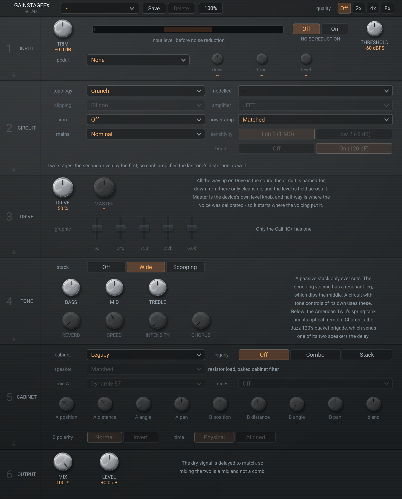

# GainStageFx

Circuit modelled gain stages, from subtle preamplifier saturation to a scooped
high gain sound. CLAP and VST3, built with [nih-plug].



Nothing here is a filter shaped to sound like an amplifier. Every voice is a
netlist — resistors, capacitors, inductors, valves, diodes, op-amps — solved by
modified nodal analysis, with Newton–Raphson wherever a part is not linear. The
sound comes out of the topology, so a capacitor in the gain leg makes the
mid-hump because that is what it does in the hardware, not because someone drew
the curve.

## The panel

Six numbered bands in the order the signal goes through them, with an arrow at
the foot of each pointing into the next. 640 × 552 at its own size, and the
button in the strip scales it from 75 % to 150 % — it is drawn rather than
pictured, so it is sharp at any of them.

| | | |
|---|---|---|
| **1 Input** | Trim, and a meter | The meter reads against the level the circuits were voiced at. Its zero is where the rest of the panel means what it says. |
| **2 Circuit** | Topology, clipping, amplifier, iron | What does the work. Clipping applies to the pedals, the amplifier choice to the preamplifier channels, and iron to everything. Rows that do not apply grey out rather than vanish. |
| **3 Drive** | Drive | All the way up is the sound the circuit is named for. Down from there only cleans up. |
| **4 Tone** | Stack, bass, mid, treble | A passive stack, so it only ever cuts. The scooping voicing has a resonant leg. |
| **5 Cabinet** | Off, combo, stack | A speaker is most of what a distorted amplifier sounds like. |
| **6 Output** | Mix, level | The dry path is delayed to match, so mixing is a mix and not a comb filter. |

## The circuits

| Voice | What it is | Measured at full drive |
|---|---|---|
| Clean | One valve stage barely working | 1.5 % distortion, almost all second harmonic |
| Crunch | Two stages, the second driven by the first | 8 % |
| High Gain | Three stages, all clipping on every note | 25 %, 11.7 % third harmonic |
| Overdrive | Diodes across the feedback resistor | 12 %, and it cleans up when hit harder |
| Distortion | Diodes across the signal to ground | 30 %, a ceiling the output stops at |
| Console | A step-up transformer into a discrete stage | 5 %, essentially all second harmonic |
| Studio | An op-amp on a studio rail | 0.00 % across the band — see below |

The two clipper families are not a matter of degree. In the loop, the diodes
lower the *gain*, so the output never stops following the input — which is why
an overdrive on a hot signal barely does anything. To ground, they are a
ceiling: past it the waveform is squared off and the harmonics fill out to the
top of the band.

### Preamplifiers, and the iron

A microphone preamplifier is not a guitar preamplifier turned down. A guitar
preamplifier is *supposed* to run out of room — that is where the sound is — and
these are built so that they do not, so everything interesting happens in the
last few decibels before they do, or in the transformer rather than the gain
stage.

The **amplifier** row picks what does the work on those channels: a valve, a
JFET, or an op-amp. A JFET follows a square law, and a square law has only a
second-order term, so it makes second harmonic and essentially nothing else
until it runs out of room. An op-amp with enough loop gain contributes nothing
of its own at all — measured, 0.00 % across the whole band at every gain
setting.

The **iron** row puts an output transformer after any circuit here, and it is
the part of this plugin that a waveshaper cannot be. What saturates in a
transformer is the *flux*, and flux is the integral of voltage — so the same
signal makes far more of it low down. Measured on a core at twelve volts:

| 30 Hz | 120 Hz | 500 Hz |
|---|---|---|
| 68 % | 4 % | 0.00 % |

No curve applied to the samples behaves that way. It is why the studio channel,
which has no character whatever of its own, reads 13.97 % at 40 Hz with iron on
it and 0.000 % without. The core is symmetric, so it makes odd harmonics where
a single-ended valve stage makes even ones.

Three materials, and they are not one another turned up: **nickel** is the only
one that colours a quiet signal and the softest when pushed, **steel** stays out
of the way then arrives hard and goes furthest, **amorphous** is still clean at
eight volts where steel is at 40 %.

Silicon, germanium and LED are selectable wherever there are diodes. They differ
by forward voltage, which is the whole reason anyone swaps them: measured,
germanium is already bending at 20 mV where an LED has not started, and the LED
overtakes it when driven hard.

## What it costs

One channel at 48 kHz, as a fraction of the time available, with each preset
set up exactly as it ships. The heaviest sound in the catalogue is Scooped
Metal — three cascaded valve stages — at 22 %; most sit between 5 and 16 %.

| Studio Preamp | Valve Colour | Green Overdrive | Blues Crunch | Console Channel | Scooped Metal |
|---|---|---|---|---|---|
| 4.6 % | 6.8 % | 12.0 % | 13.8 % | 15.2 % | 22.2 % |

Doubling the Quality setting roughly doubles the cost: Scooped Metal is 22 % at
two times and 45 % at four. The presets ask for what their own sound needs, so
raise it only when you want to hear the difference.

The Quality control is part of the sound rather than only of the cost, and the
presets set it. Measured against an eight times reference at 3 kHz, a diode
clipper to ground aliases 31 dB down at two times and 71 at four, so the pedals
ask for four; a three stage valve cascade is already 55 dB down at two, and it
is the cascade that costs anything, so paying for four there buys nothing
audible. Raise it by hand if you want to hear the difference.

## Presets

Thirty-six, in six groups, ordered quietest first so the list reads as a range.
Measured end to end the catalogue runs from 0.00 % distortion to 26 %. The
**Studio** group holds the console and microphone-preamplifier sounds, with the
cabinet off throughout — a guitar speaker in front of a microphone preamplifier
makes no sense at all, and a test enforces it.

Each one is a full set of panel positions — loading one and looking at the panel
tells you how the sound is made. **Scooped Metal** is three cascaded stages, the
scooping voicing with the mid control right down, and a stack behind it.

Save your own with the button beside the name; they go to
`~/.config/gainstagefx/presets` as readable JSON and appear under their own
**Saved** heading at the foot of the list. Only those can be deleted — saving
under a shipped preset's name writes a new file beside it rather than replacing
it, so the shipped one never becomes unreachable. A dot next to the name means
the panel has been moved since the preset was loaded; move the control back and
the dot goes, because that state is compared rather than remembered.

Loading a preset goes out as ordinary parameter gestures, so it lands in a DAW's
automation lanes and undoes in one step like any other edit.

## Installing

Built archives for Linux, macOS and Windows are attached to each
[release](https://github.com/BurningTreeC/gainstagefx/releases), built from the
tag by GitHub Actions. Download the one for your platform and run the installer
inside it — `install.sh`, `Install.command` or `install.exe`. `README.txt` in
the archive covers installing by hand.

## Building

```sh
cargo xtask bundle gainstagefx --release   # CLAP and VST3 in target/bundled
cargo test --release                        # the measurements
./install.sh                                # into the usual places
```

Every claim in this README that has a number in it is checked by a test that
measures it. `cargo test --release` runs ninety-three of them.

## How it is built

`src/dsp` is the engine and knows nothing about audio plugins:

- **`netlist`** — circuits as named nodes, validated before use. A dangling node
  or an unreachable output is a `Fault`, not a silent wrong answer.
- **`ac`** — stamps the matrix with complex admittances and solves per
  frequency. Exact, in microseconds, no audio involved. Refuses to run on a
  circuit containing a device, because a device has no single frequency
  response.
- **`time`** — trapezoidal companion models, Newton–Raphson with junction
  voltage limiting, and a separate DC matrix for the operating point with
  capacitors open and inductors shorted.
- **`device`** — the nonlinear parts: Koren triode, Shockley diode, and a
  two-state op-amp. Parts that impose a voltage rather than a conductance get a
  branch unknown of their own.
- **`measure`** — bin-aligned probe tones with phase continuous across the
  settle boundary.

The two solvers overlap deliberately. On a linear network they must agree, and
`tests/agreement.rs` is the only real check either of them has.

## What the measurements caught

The discipline here is that a number nothing can disagree with is not a
measurement. Several times the thing that turned out to be wrong was the
measurement, and several times it was me:

- A linear network read 2.6 % distortion because the probe tone's phase
  restarted between settling and capture. Nothing was wrong with the circuit.
- A gain control moved the Clean voice 6 dB end to end, on the reasoning that a
  gain control sets how much local feedback each stage keeps. It does not: a
  cathode bypass is bounded by the cathode resistor. It is a volume pot now, and
  the range is 80 dB.
- A linear rheostat cannot sweep evenly in decibels — for a span of 48 it put 18
  of its 30 dB into the first quarter of the travel and 2 into the last. The
  track has to be shaped for the span it covers.
- The oversampler handed the circuit four samples for every one the host sent
  while the circuit still solved with the host's timestep, putting every corner
  frequency four times too high. It cost the overdrive 11 dB and the valve
  voices almost nothing, so nothing but the clipper would have shown it.
- An operating point converged, satisfied its own tolerance, and was wrong,
  because the matrix was stale. Kirchhoff caught it; convergence could not.
- `Device::advance` sat on the trait uncalled from the beginning and nothing
  noticed, because every device until the transformer core was memoryless. The
  core integrates, and unadvanced its flux never accumulated past one sample: it
  drew a hundred-thousandth of the current it should have and read 0.00 % at
  every frequency, level and material.
- A channel's gain control sat between the gain stage and the output
  transformer, which looks like a reasonable place for it. A pot's wiper
  impedance is highest in the middle of its travel, and a transformer colours
  according to what feeds it, so the channel measured 18 % distortion at half
  gain and 5 % at full — the knob inverted the character as it crossed the
  middle.

[nih-plug]: https://github.com/robbert-vdh/nih-plug

## Licence

GPL-3.0-or-later — the full text is in [`LICENSE`](LICENSE).

The VST3 bindings this links are GPL, so the whole is. Every crate it links is
listed with its own licence and copyright notice in
[`THIRD-PARTY-NOTICES.md`](THIRD-PARTY-NOTICES.md); regenerate that with
`python3 tools/third-party-notices.py`.

VST is a trademark of Steinberg Media Technologies GmbH, registered in Europe
and other countries. CLAP is a trademark of its respective owners. Neither this
project nor its authors are affiliated with or endorsed by them.
