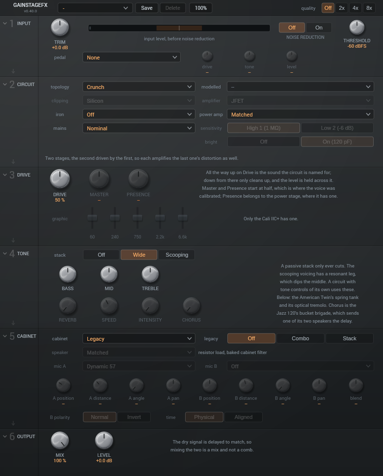

# GainStageFx

Circuit modelled gain stages, from subtle preamplifier saturation to a scooped
high gain sound, and the rest of a guitar rig behind them: a pedal in front,
a power stage, a speaker that loads it, a cabinet and up to two microphones.
CLAP and VST3 on Linux, Windows and macOS, and an Audio Unit (v2) on macOS as
well; built with [nice-plug], with a [vizia] panel.



Nothing here is a filter shaped to sound like an amplifier. Every circuit is a
netlist — resistors, capacitors, inductors, valves, transistors, diodes,
op-amps, transformers — solved by modified nodal analysis, with Newton–Raphson
wherever a part is not linear. The sound comes out of the topology, so a
capacitor in the gain leg makes the mid-hump because that is what it does in the
hardware, not because someone drew the curve.

## The chain

```text
PEDAL -> CIRCUIT (preamp) -> POWER AMP <-> SPEAKER LOAD -> CONE -> CABINET -> MIC A / MIC B -> OUTPUT
```

Each stage is chosen on its own. A pedal can sit in front of any circuit, any
circuit can drive any power stage, and any power stage can drive any speaker in
any cabinet. The arrow between the power amp and the speaker goes both ways:
the speaker's impedance is part of the power stage's own netlist, so its
resonance and rising voice-coil impedance change what the valves, the output
transformer and the negative feedback do. It is not an EQ after the fact.

Every new stage defaults to what the plugin did before it existed — no pedal,
**Matched** power stage, **Legacy** cabinet — so old sessions and presets load
and sound as they did.

## The panel

Six numbered bands in the order the signal goes through them, with an arrow at
the foot of each pointing into the next. Each band opens and closes from its
header row — number, name and chevron — and the window grows and shrinks to
fit what is open: a fresh panel opens with the input alone, and the session
remembers which are open. 780 wide; 306 tall with only the input open, 968 with
all six. The button in the strip scales it from 75 % to 200 %, in seven steps
(the wheel over it steps through them too) — it is drawn rather than pictured,
so it is sharp at any of them. The model lists are dropdowns, and
the wheel over a closed one steps through it, which is the quickest way to hear
what is in it.

| | | |
|---|---|---|
| **1 Input** | Trim, meter, noise reduction, pedal with its own knobs, named as its box names them | The meter reads against the level the circuits were voiced at. Its zero is where the rest of the panel means what it says. |
| **2 Circuit** | Topology or modelled circuit, clipping, amplifier, iron, power amp, mains; the blackface amplifiers' input jack, the bright switch (the JC-120's and the SVT's Ultra Hi too), and a circuit's own low and mid switches of two to four positions (the SVT's BASS and MIDRANGE SELECT, the German 76's low cut and "3 kHz") | What does the work. Clipping applies to the diode circuits, the amplifier choice to the preamplifier channels, iron to everything. Lists that do not apply grey out rather than vanish. |
| **3 Drive** | Drive and master, named as the circuit names them (on a pedal, its drive and level), presence, and the Cali IIC+'s five-band graphic | All the way up is the sound the circuit is named for. Down from there only cleans up. |
| **4 Tone** | Stack, bass, mid, treble; reverb, speed, intensity, chorus | A passive stack, so it only ever cuts. A modelled amplifier's own stack takes these knobs, and so do the Metal Zone's three bands; a pedal's single tone control (TONE, or the Rodent's FILTER) has a knob of its own beside them, as do the Metal Zone's swept middle and the Heavy Metal's Colour Mix pair. The second row is the blackface amplifiers' reverb and tremolo and the Jazz 120's chorus. |
| **5 Cabinet** | Cabinet, speaker, mic A, mic B, placement, pan, blend, polarity, time | Legacy keeps the old baked cabinet filter; any other cabinet switches to the physical path. |
| **6 Output** | Mix, level | The dry path is delayed to match, so mixing is a mix and not a comb filter. |

Bypass is the host's: the plugin reports a bypass parameter, so the DAW's own
bypass switch and automation lane drive it.

**Noise reduction** is an optional gentle input expander, switched Off/On in the
Input section. It defaults to Off, including in older sessions and factory presets.
Start with the threshold at -60 dBFS and raise it only enough to reduce noise
between notes. The threshold measures the signal after input trim; the input meter
keeps its existing nominal-level reference. Both stereo channels share one detector
so the louder side keeps both open. Below the soft knee it expands 2:1, with at most
40 dB attenuation, a fast opening and a slow release. Switching it adds no latency.
It precedes the pedal and amp, preserving their reverb and cabinet decays; it does
not remove hum or hiss underneath a sustained note.

## The circuits

### Topologies

| Circuit | What it is | Measured at full drive |
|---|---|---|
| Clean | One valve stage barely working | 3 % distortion, almost all second harmonic |
| Crunch | Two stages, the second driven by the first | 30 % |
| High Gain | Three stages, all clipping on every note | 48 % |
| Overdrive | Diodes across the feedback resistor | 30 % (silicon), and it cleans up when hit harder |
| Distortion | Diodes across the signal to ground | 42 % (silicon), a ceiling the output stops at |
| Console | A step-up transformer into a discrete stage | 3 %, almost all second harmonic with a valve |
| Studio | An op-amp on a studio rail | 0.00 % across the band — see below |

Measured on a guitar's 0.122 V, except the Clean stage, the Console and the
Studio, which are fed the level that gives them their intended figure (about a
volt for the Clean stage); `src/calibration.rs` records each one, and
`examples/calibrate.rs` regenerates it.

The two clipper families are not a matter of degree. In the loop, the diodes
lower the *gain*, so the output never stops following the input — which is why
an overdrive on a hot signal barely does anything. To ground, they are a
ceiling: past it the waveform is squared off and the harmonics fill out to the
top of the band.

### Modelled circuits

Particular circuits, built part by part from their schematics. Each has a
research log in [`docs/models`](docs/models) recording the revision, the
sources, where they disagree and what was approximated.

| Circuit | Built from | Power stage when Matched |
|---|---|---|
| Green 808 | A 1970s green overdrive pedal: input buffer, clipping amp, tone and level, output buffer | none |
| Ram Fuzz | A 1973 four-transistor fuzz | none |
| Cali IIC+ | A 1980s Californian lead channel: six triodes through its lead return and recovery stage, its own stack and five-band graphic | Cali 6L6 |
| American 5150 | A 1990s high-gain lead channel: six triodes, one run cold, into its own tone stack | American 6L6 High-Gain |
| British 73 | A transformer-coupled class-A microphone preamplifier and line driver | none (its line driver stays) |
| American 312 | A console microphone preamplifier card: input transformer, one discrete op-amp, output transformer | none |
| British 4K E | A 1980s console channel's microphone input: a 1:10 transformer into two op-amps around one gain pot | none |
| Tube 610 | A 1960s valve console channel: four triodes in two feedback loops, a transformer at each end | none |
| British 47 | A late-50s British studio valve amplifier: a pentode and a paralleled triode between a 1:7 and a 7:1 transformer, two feedback loops, its gain a three-position switch on the Drive knob | none |
| German 76 | A late-50s German broadcast microphone amplifier: two two-valve amplifiers, each in its own loop, between a 1:30 and a 9:1 transformer; its gain a twelve-step switch on the Drive knob (3 to 76 dB), its low cut and "3 kHz" on the panel's switches | none |
| American Twin | A 1960s blackface clean channel with spring reverb and optical tremolo | American 6L6 Clean |
| American Deluxe | The smaller blackface combo's vibrato channel: the same design with spring reverb and optical tremolo, no middle control, into two 6V6s on a valve rectifier | American Deluxe 6V6 |
| American Deluxe Normal | The same amplifier through its normal channel: no bright capacitor, no reverb, no tremolo | American Deluxe 6V6 |
| Brit 800 | An early-80s British 100 W master-volume lead preamp: four triodes, a cathode follower into its own stack | Brit EL34 |
| Brit 2205 | The boost channel of a mid-80s British 50 W two-channel head: a diode-biased second stage and a diode clipper, then the stack, the master and a make-up stage | Brit 2205 EL34 |
| Brit Plexi | A late-60s British 100 W lead amp with no master: the bright channel's three triodes into its own stack, so the Volume decides how hard the power valves work | Brit Plexi EL34 |
| Brit AC30 | A 60s British 30 W combo: a top-boost valve into a stack with no middle control, then self-biased power valves with no feedback loop at all | AC30 EL84 |
| Brit DR103 | A British 100 W head built for headroom: five triodes, a master volume, and an inverter the driver holds still so it cannot shift its bias | DR103 EL34 |
| Cali Rectifier | A 90s American two-channel head, red channel: five triodes with one run cold on 39 k, which is where its bottom end is squared off; its presence is in the preamplifier | Recto 6L6 (or Recto 6L6 Tube) |
| Jazz 120 | A transistor 2x12 combo's first channel, with its bucket-brigade chorus | its own transistor power amplifier, which comes with it |
| Green 9 | The green overdrive with the later pedal's output resistors | none |
| Rodent | A hard-clipping distortion whose slow op-amp runs out of gain-bandwidth before it runs out of gain | none |
| Round Fuzz | Two germanium transistors and a feedback resistor | none |
| Yellow Dist | One slow op-amp and a pair of germanium diodes to ground | none |
| Heavy Metal | A gated distortion: two germanium diodes in series with the signal, and three gyrators | none |
| Metal Zone | Two gain stages and seven filters, with a three-band equaliser whose middle sweeps | none |
| Orange Dist | A transistor that clips first and a diode pair that clips what is left, with the bass cut before either and a scoop after | none |
| Treble Boost | One germanium transistor behind a 5 nF capacitor; its one knob is a volume after a fixed gain | none |
| Brit Plexi Bass | The Brit Plexi's late-60s bass sibling of the same drawing set: V1's halves on one cathode, nothing throwing the bottom away, an unbypassed second stage, a 250 pF / 56 k stack and no master | Brit Plexi Bass EL34 |
| Brum 100 | A late-60s Midlands 100 W head, Marshall-like and not a Marshall: split V1 cathodes, a 270 pF / 56 k / 22 k stack and no master, into four EL34s on 600 V | Brum EL34 |
| Oregon T | An early-70s American 150 W head: a tweed-style preamp with a master, into four 6550s in ultra-linear | Oregon 6550 |
| American SVT | A 70s American 300 W bass head's first channel: a James stack, a midrange whose toroid resonance sits inside a two-stage feedback loop, its three-way midrange frequency and Bass Cut / Ultra Lo switches, and Ultra Hi on the Bright switch | American 6550 |
| Gold Drive | An overdrive whose germanium-clipped path is summed with two clean ones | none |
| Brit Drive | Two op-amp stages into red LEDs, then a bass, middle and treble stack | none |
| Clean Boost | One op-amp, one knob, up to 26 dB | none |

**Every pedal is also a circuit.** The thirteen in the pedal slot can each be
selected on their own, with nothing behind them — which is how a pedal into a
desk was always recorded, and how an HM-2 into an MT-2 becomes expressible: one
in the slot, the other as the circuit. Selected as the circuit, a pedal keeps
its knobs and their names: its drive and level on the Drive section's first
two, its tone controls in the Tone section. The list is grouped under **PEDALS**,
**AMPLIFIERS** and **MICROPHONE PREAMPS**, because it now holds three different
kinds of thing.

Display names are generic on purpose. Which hardware each one was built from is
in [What each name is](#what-each-name-is) below, and in the research logs
alongside the stable ids saved sessions use.

### Preamplifiers, and the iron

A microphone preamplifier is not a guitar preamplifier turned down. A guitar
preamplifier is *supposed* to run out of room — that is where the sound is — and
these are built so that they do not, so everything interesting happens in the
last few decibels before they do, or in the transformer rather than the gain
stage.

The **amplifier** list picks what does the work on those channels: a valve, a
JFET, or an op-amp. A JFET follows a square law, and a square law has only a
second-order term, so it makes second harmonic and essentially nothing else
until it runs out of room. An op-amp with enough loop gain contributes nothing
of its own at all — measured, 0.00 % across the whole band at every gain
setting.

The **iron** list puts an output transformer after any circuit here, and it is
the part of this plugin that a waveshaper cannot be. What saturates in a
transformer is the *flux*, and flux is the integral of voltage — so the same
signal makes far more of it low down. Measured on a core at twelve volts:

| 30 Hz | 120 Hz | 500 Hz |
|---|---|---|
| 68 % | 4 % | 0.00 % |

No curve applied to the samples behaves that way. It is why the studio channel,
which has no character whatever of its own, reads 13.97 % at 40 Hz with iron on
it and 0.000 % without. The core is symmetric, so it makes odd harmonics where
a single-ended valve stage makes even ones.

Three materials, and they are not one another turned up: **nickel** is the only
one that colours a quiet signal and the softest when pushed, **steel** stays out
of the way then arrives hard and goes furthest, **amorphous** is still clean at
eight volts where steel is at 40 %.

Silicon, germanium and LED are selectable wherever there are diodes. They differ
by forward voltage, which is the whole reason anyone swaps them: measured,
germanium is already bending at 20 mV where an LED has not started, and the LED
overtakes it when driven hard.

## The pedal

**Green 808**, **Ram Fuzz**, **Green 9** (the 808 with the later pedal's
output resistors), **Rodent** (a hard-clipping distortion whose slow op-amp runs out
of gain-bandwidth and slew rate, as the original's does), **Round Fuzz** (two
germanium transistors), **Yellow Dist** (one slow op-amp and a pair of germanium
diodes to ground), **Heavy Metal** (a gated distortion with two tone controls),
**Metal Zone** (two gain stages and seven filters, with a three-band equaliser
whose middle sweeps), **Orange Dist** (a transistor booster that clips before
the op-amp and diodes do, with the bass cut ahead of both), **Treble Boost**
(one germanium transistor behind a 5 nF capacitor, whose single knob is the
slot's level -- its drive knob is greyed, because it has no drive), **Gold
Drive** (a germanium-clipped gain stage summed with two clean paths, and a
treble shelf), **Brit Drive** (two op-amp stages into red LEDs and a
three-knob stack) and **Clean Boost** (one op-amp and one knob, its gain: the
level knob is greyed),
each with the knobs that pedal actually has, in front of
whichever circuit is selected — so a Green 808 into the American Twin keeps both
sets of controls. The pedal is its own netlist, solved before the circuit it
feeds, so a pedal can also sit in front of itself.

A pedal's knobs are the ones that pedal has, named the way its box names them
(overdrive, sustain, distortion, fuzz; level, volume, output): most have three, the Heavy Metal has two tone controls (its
Colour Mix pair), the Metal Zone has four including a swept mid, and the panel
grows a knob for each. The Heavy Metal is also
the only **gated** distortion here -- two germanium diodes sit in series with
the signal rather than across it, so quiet playing is held back entirely and
the pedal cuts off rather than fading.

The slot is level matched the way the circuit list is. Each pedal's **Level**
knob at noon is *unity through that pedal* — its own measured position, a little
above half on most of them, because the level control of a pedal is an attenuator
after a stage with gain (the Orange Dist's is a third of the way up its linear
track, because it has a great deal of gain in front of it). So switching pedals with the knobs where they are moves
the level by a few decibels rather than by ten, and what is left is the pedals
being different pedals: a fuzz at half its drive really does make more than a
clean boost does. And the pedal is fed a guitar whatever follows it, while the
circuit behind it is fed the level *it* was calibrated at — a guitar for the
amplifiers, up to a volt for the clean stage and the consoles — so a pedal in
front of the clean circuit sounds like a pedal rather than like a fault.

## The mains

**Nominal**, **90 %**, **80 %** or **70 %**. A valve amplifier's supplies all come from
one transformer, so running it from a variac brings every rail down together: the valves
have less room, the bias follows them, and the amplifier goes soft and compressed at a
setting where it used to be loud and clean. It is a selection rather than a knob because
that is what it was — how the rig was wired, not something anyone swept while playing.
The Brown '78 and Brown '84 presets run at 70 %, because the engineer who recorded
those records says the amplifier ran at 80 to 85 volts; Blizzard '80 runs at 80 %, the
nearest setting to the 90 volts that player is reported to have used.

## The power stage

| Choice | What it is |
|---|---|
| Matched | The selected amplifier's own power stage; none for pedals, topologies and the studio preamplifiers. The Jazz 120's transistor amplifier and the British 73's line driver come with them and are not in this list |
| Bypass | No power stage: phase inverter, output valves, feedback and output transformer all skipped |
| Cali 6L6 | Two 6L6s, long-tailed-pair inverter, a light loop with the presence in series with it |
| American 6L6 Clean | Four 6L6s with a 12AT7 inverter and light feedback — the clean one |
| American 6L6 High-Gain | Four 6L6s, with the feedback through a resonance network and the presence off it |
| Brit EL34 | Four EL34s from a 1981 British 100 W master-volume drawing; the Brit 800's own |
| Brit Plexi EL34 | Four EL34s from a 1970 drawing of the non-master head: no master, four times the 2203's feedback, a 5 k presence whose track is the bottom of the inverter's tail; the Brit Plexi's own |
| Brit 2205 EL34 | Two EL34s from a 1988 drawing of the 50 W two-channel head: its own low-leak inverter, feedback from the 4 Ω tap; the Brit 2205's own |
| AC30 EL84 | Four EL84s sharing a 50 ohm cathode resistor, no feedback loop, and a cut control across the inverter; the Brit AC30's own |
| DR103 EL34 | Four EL34s on 22 k grid stoppers and a tight loop; the inverter's grids held by a follower on its own divider, and the Hiwatt's presence loop back to the last preamp valve, which behind the Brit DR103 is built into this stage; the Brit DR103's own |
| Recto 6L6 | Four 6L6s on a cold -51 V bias from the manufacturer's own drawing, with no feedback loop, as in the red channel's Modern mode; the Cali Rectifier's own |
| Recto 6L6 Tube | The same stage with its rectifier switch on valve: two 5U4GB, so the rail sits lower and sags under a chord |
| American Deluxe 6V6 | Two 6V6s behind a 12AT7 inverter on a GZ34 valve rectifier, with the AB763's light feedback and no presence; the American Deluxe's own |
| Brit Plexi Bass EL34 | The Brit Plexi EL34 with the 1992's .1 uF couplings into the output valves, where the 1959 has .022: the corner moves from 33 Hz to 7 Hz; the Brit Plexi Bass's own |
| Brum EL34 | Four EL34s on 600 V and -54 V, as the trace prints them, with 10 k grid stoppers, 470 ohm screens and a 3.3 k presence whose track is the inverter's tail; the Brum 100's own |
| Oregon 6550 | Four 6550s in **ultra-linear** -- each side's screens on a tap of its own half of the primary -- behind a 12AX7 long-tailed pair, with 22 k of feedback from the 16 ohm tap and a reverse-log presence; the Oregon T's own |
| American 6550 | Six 6550s held by two **direct-coupled cathode followers** -- the output grids are driven into grid current with no coupling capacitor of their own to charge -- behind a 12BH7 gain stage a side and a cathodyne, on 660 V with the drivers on the screens' sagging rail; the American SVT's own |

A power stage is a complete netlist: master, inverter, bias, grid coupling,
output valves with their screen supplies, a centre-tapped transformer with a
nonlinear core, and the feedback loop around all of it. Choosing one behind a
different circuit is level matched against that circuit's own, so trying
combinations does not mean chasing the fader.

**Presence** turns the power stage's own presence control -- the one in its
feedback loop -- and on the AC30 EL84 its **Cut** control instead, which is what
that amplifier has in the same place. Half way is where the stage has always
rested, so it changes nothing until it is moved; on most stages that is also the
pot's own half, so a player's "presence 7" is 70 %. It is greyed where the stage
has nothing there: the American 6L6 Clean and Deluxe 6V6 (an AB763 has no
presence), the transistor stages, and Bypass. The DR103 EL34's is the Hiwatt's
own, a loop from the feedback node back to the last preamp valve, which is why
that power stage now begins at that valve. The Cali 6L6's is a rheostat *in
series with* its loop, as the Mark IIC+'s is: turned up it takes treble out of the
feedback first and some of everything else after, so the whole stage loosens a
little as the top comes up. The Recto stages have no loop -- in the red channel's
Modern mode the Dual Rectifier lifts it -- so there the knob turns the **Cali
Rectifier's** own presence, a treble shunt in its preamplifier, whatever power
stage is behind it; behind any other circuit the Recto stages grey it.

## Speaker, cabinet and microphones

**Cabinet:** Legacy (the old resistor load and Combo/Stack filter, the default),
Bypass (the driver on an open baffle), or one of thirteen cabinets with real
dimensions and driver layouts: Brit 1960 4x12, Cali Oversized 4x12, Brit Closed
4x12, Brit Green 4x12, Brit V30 4x12, Oversized 4x12, American Open 2x12,
American Open 1x12, Closed 1x12, Closed 2x12, Jazz Open 2x12, American Closed 4x12,
and the American 8x10 -- eight tens in four sealed chambers of two, the American
SVT's own box, whose standing waves are a chamber's while its sealed air is the
whole cabinet's.

Bypass there means *no box*, not no speaker: the driver still radiates, on an
open baffle, and a microphone still picks it up, which is why it does not sound
like Legacy with its filter off. The way past the acoustic path is the speaker
row's own Bypass, and that is bit-identical to Legacy/Off (a test says so).

**Speaker:** Matched (the cabinet's own driver), Bypass (the power stage's
output, a DI), or Brit V30, Brit Green 25, Brit T75, American Vintage 12,
American Vintage 10, American Ceramic, American Alnico, Jazz 12, Brit K85, American Bass 10. Each is a Thiele–Small
electrical and mechanical model with a lossy voice coil, fitted to the
manufacturer's impedance and response data where it is published and estimated
where it is not, and its impedance is solved inside the power
stage. A closed box stiffens the suspension in that same solve, so a 4x12 moves
the resonance the valves see.

**Microphones:** eleven profiles — dynamic, ribbon, condenser, valve condenser
and FET condenser — each with its own polar pattern, proximity effect,
response and off-axis loss. Mic A is always there (its Bypass is an ideal omni);
mic B can be off. Each has **position** (centre to edge of the cone),
**distance** and **angle**, placed in three dimensions against every driver in
the cabinet: close up the nearest cone dominates, further back the array adds
up at low frequencies and beams at high ones, an open back cancels its own
bass, and two microphones at different distances comb-filter unless **time** is
set to Aligned. **B polarity** inverts mic B, and **blend** mixes the two.

Each microphone also has a **pan**, which is how one cabinet becomes a stereo
image: put A and B on opposite sides and the two capsules land in different
places in the mix rather than being summed. Centre means the whole signal on
both sides, which is what a mono source on a stereo bus has always done here, so
leaving both pans centred changes nothing at all. The pans apply where one
amplifier feeds both outputs -- a mono guitar on a stereo track. A genuinely
stereo input is already two independent amplifiers, and each keeps its own side.

The models, the equations and what each number is based on are in
[`SPEAKER_MODEL.md`](SPEAKER_MODEL.md), [`CABINET_MODEL.md`](CABINET_MODEL.md)
and [`MICROPHONE_MODEL.md`](MICROPHONE_MODEL.md).

## What each name is

The panel's names are generic; the hardware behind them is not. This is the
whole mapping, with the research log for each — the log is where the revision,
the sources, the places they disagree and everything approximated are written
down. Every model is built from published drawings and data sheets, part by
part; a name in the right-hand column is a statement about *what was measured
against*, not a claim of any connection with the manufacturer. All trademarks
belong to their owners, who have neither endorsed nor been involved in this.

**Circuits** — the ones marked *generic* are designed topologies with no
hardware behind them at all.

| Panel | Modelled from | Log |
|---|---|---|
| Clean / Crunch / High Gain | *generic*: one, two and three cascaded ECC83 stages | — |
| Overdrive / Distortion | *generic*: diodes in the feedback loop, and diodes to ground | — |
| Console / Studio | *generic*: a step-up transformer into a discrete stage; an op-amp on studio rails | — |
| Green 808 | Ibanez TS808 Tube Screamer (JRC4558D, 1N4148 pair, BC549 buffers) | [green_808.md](docs/models/green_808.md) |
| Ram Fuzz | Electro-Harmonix Big Muff Pi, 1973 Ram's Head | [big_muff.md](docs/models/big_muff.md) |
| Cali IIC+ | Mesa/Boogie Mark IIC+ lead channel, 60 W | [cali_iic_plus.md](docs/models/cali_iic_plus.md) |
| American 5150 | Peavey EVH 5150, the original (1992), lead channel | [american_5150.md](docs/models/american_5150.md) |
| American Twin | Fender Twin Reverb AB763 (blackface), vibrato channel | [american_twin.md](docs/models/american_twin.md) |
| American Deluxe | Fender Deluxe Reverb AB763 (blackface), vibrato channel | [american_deluxe.md](docs/models/american_deluxe.md) |
| American Deluxe Normal | the same amplifier through its Normal channel: no bright cap, no reverb, no tremolo | [american_deluxe.md](docs/models/american_deluxe.md) |
| Brit 800 | Marshall JCM800 2203 100 W, 1981 drawing | [brit_800.md](docs/models/brit_800.md) |
| Brit 2205 | Marshall JCM800 2205 50 W, boost channel, later circuit, 1987/88 drawings | [brit_2205.md](docs/models/brit_2205.md) |
| Brit Plexi | Marshall 1959 Super Lead 100 W, bright channel, 1970 drawing | [brit_plexi.md](docs/models/brit_plexi.md) |
| Brit AC30 | Vox AC30/6 Top Boost, brilliant channel | [brit_ac30.md](docs/models/brit_ac30.md) |
| Brit DR103 | Hiwatt DR103 Custom 100, brilliant channel, Issue 4 | [brit_dr103.md](docs/models/brit_dr103.md) |
| Cali Rectifier | Mesa/Boogie Dual Rectifier, two-channel Rev F, red channel modern | [cali_rectifier.md](docs/models/cali_rectifier.md) |
| Jazz 120 | Roland JC-120 Jazz Chorus, CH-1 and its MN3007 chorus, the JC-120UT/JT of Sep. 2000 | [jazz_120.md](docs/models/jazz_120.md) |
| British 73 | DIY Recording Equipment 73P v1.1 (a 1073-style 500-series card) | project-local drawings |
| American 312 | API 312 microphone preamplifier card (2622, 2520, 2503) | [american_312.md](docs/models/american_312.md) |
| British 4K E | SSL SL 4000 E channel amp, 82E01 microphone amplifier | [british_4k_e.md](docs/models/british_4k_e.md) |
| Tube 610 | Universal Audio 610-A modular console preamplifier | [tube_610.md](docs/models/tube_610.md) |
| British 47 | EMI REDD.47 line amplifier, drawing REDD.47/C1 (1959) and description REDD.M47 | [british_47.md](docs/models/british_47.md) |
| German 76 | Telefunken/TAB V76/80 microphone amplifier, IRT drawing S 1176 and Braunbuch description (1959) | [german_76.md](docs/models/german_76.md) |
| Brit Plexi Bass | Marshall JMP 1992 Super Bass 100 W, Unicord drawing 70-13-11, July 1970 | [brit_plexi_bass.md](docs/models/brit_plexi_bass.md) |
| Brum 100 | Laney Supergroup 100 Mk I, a 1969 build, from a traced drawing | [brum_100.md](docs/models/brum_100.md) |
| Oregon T | Sunn Model T, drawing D-1029 A, 1973, BRITE channel | [oregon_t.md](docs/models/oregon_t.md) |
| American SVT | Ampeg SVT (6550), "SVT PREAMP" D 591719 rev D, 1975, channel 1, NORMAL input | [american_svt.md](docs/models/american_svt.md) |
| Green 9, Rodent, Round Fuzz, Yellow Dist, Heavy Metal, Metal Zone, Orange Dist, Treble Boost, Gold Drive, Brit Drive, Clean Boost | the pedals above, selectable as circuits in their own right | as listed under Pedals |

**Pedals** (the slot in front of whatever is selected)

| Panel | Modelled from | Log |
|---|---|---|
| Green 808 | Ibanez TS808 Tube Screamer | [green_808.md](docs/models/green_808.md) |
| Green 9 | Ibanez TS9 — the 808 with its output resistors | [green_9.md](docs/models/green_9.md) |
| Ram Fuzz | Electro-Harmonix Big Muff Pi, 1973 Ram's Head | [big_muff.md](docs/models/big_muff.md) |
| Rodent | Pro Co RAT, the LM308 revision | [rodent.md](docs/models/rodent.md) |
| Yellow Dist | MXR Distortion+, the 741 version | [yellow_dist.md](docs/models/yellow_dist.md) |
| Round Fuzz | Arbiter Fuzz Face, germanium (1966–68) | [round_fuzz.md](docs/models/round_fuzz.md) |
| Heavy Metal | Boss HM-2 Heavy Metal, the Japanese original | [heavy_metal.md](docs/models/heavy_metal.md) |
| Metal Zone | Boss MT-2 Metal Zone | [metal_zone.md](docs/models/metal_zone.md) |
| Orange Dist | Boss DS-1 Distortion, the TA7136P original (before the 1994 DS-1A) | [orange_dist.md](docs/models/orange_dist.md) |
| Treble Boost | Dallas Rangemaster Treble Booster, the stock OC44 unit | [treble_boost.md](docs/models/treble_boost.md) |
| Gold Drive | Klon Centaur, from ElectroSmash's analysis (the board was potted; no Klon drawing exists) | [gold_drive.md](docs/models/gold_drive.md) |
| Brit Drive | Marshall The Guv'nor, the original (1988-92), from ElectroSmash's analysis | [brit_drive.md](docs/models/brit_drive.md) |
| Clean Boost | MXR M-133 MicroAmp, from ElectroSmash's analysis | [clean_boost.md](docs/models/clean_boost.md) |

**Power stages**

| Panel | Modelled from | Log |
|---|---|---|
| Cali 6L6 | Mark IIC+ 60 W: ECC83 inverter, two 6L6GC, the loop and series presence as the RP10/FINAL redraws draw them | [cali_iic_plus.md](docs/models/cali_iic_plus.md) |
| American 6L6 Clean | Twin Reverb AB763: ECC81 inverter, four 6L6GC, 820 Ω feedback | [american_twin.md](docs/models/american_twin.md) |
| American 6L6 High-Gain | 5150: ECC83 inverter, four 6L6GC, 39 k feedback through the resonance network (it rests at noon; no knob) | [american_5150.md](docs/models/american_5150.md) |
| Brit EL34 | JCM800 2203: four EL34 at −42 V, feedback from the 4 Ω tap | [brit_el34.md](docs/models/brit_el34.md) |
| Brit Plexi EL34 | 1959 Super Lead: the same iron with no master, 47 k feedback | [brit_plexi.md](docs/models/brit_plexi.md) |
| Brit 2205 EL34 | JCM800 2205: two EL34 at −36 V, 330 k / 120 k inverter leaks, Hammond 1750N replacement-iron data | [brit_2205.md](docs/models/brit_2205.md) |
| AC30 EL84 | AC30 Top Boost: four cathode-biased EL84, no feedback loop, cut control, GZ34 rectifier | [brit_ac30.md](docs/models/brit_ac30.md) |
| DR103 EL34 | Hiwatt DR103: four EL34, inverter direct-coupled to its driver | [brit_dr103.md](docs/models/brit_dr103.md) |
| *(matched to Jazz 120)* | Roland JC-120: 60 W complementary transistor amplifier, 2SC4386/2SA1671, bootstrapped VAS | [jazz_120.md](docs/models/jazz_120.md) |
| American Deluxe 6V6 | Deluxe Reverb AB763: 12AT7 inverter, two 6V6GT, GZ34 rectifier | [american_deluxe.md](docs/models/american_deluxe.md) |
| Recto 6L6 / Recto 6L6 Tube | Dual Rectifier: four 6L6 on the silicon setting, or two 5U4GB valve rectifiers; the loop lifted, as in RD NORM | [cali_rectifier.md](docs/models/cali_rectifier.md) |
| Brit Plexi Bass EL34 | 1992 Super Bass: the 1959's stage of the same drawing set with .1 uF output couplings | [brit_plexi_bass.md](docs/models/brit_plexi_bass.md) |
| Brum EL34 | Laney Supergroup 100 Mk I: four EL34 on 600 V, 3.3 k presence on the tail | [brum_100.md](docs/models/brum_100.md) |
| Oregon 6550 | Sunn Model T: four 6550 ultra-linear (GE 6550-A fit), 22 k feedback from 16 ohm, chart-fitted supply | [oregon_t.md](docs/models/oregon_t.md) |
| American 6550 | Ampeg SVT "SVT POWER AMP SCHEMATIC" D 591720 rev H: six 6550, 12BH7 (RCA fit) gain stages and followers, a cathodyne, 47 k from 4 ohm; idle at the calibration procedure's 24 mA a valve | [american_svt.md](docs/models/american_svt.md) |

**Cabinets, speakers and microphones** — dimensions from the manufacturers,
Thiele–Small parameters and response curves from data sheets where they are
published and estimated where they are not ([cabinets.md](docs/models/cabinets.md),
[speakers.md](docs/models/speakers.md), [microphones.md](docs/models/microphones.md)).

| Cabinet | Modelled from | Speaker | Modelled from |
|---|---|---|---|
| Brit 1960 4x12 | Marshall 1960A, angled | Brit V30 | Celestion Vintage 30 |
| Brit Closed 4x12 | Marshall 1960B, straight | Brit Green 25 | Celestion G12M-25 Greenback |
| Brit Green 4x12 | Marshall 1960AX | Brit T75 | Celestion G12T-75 |
| Brit V30 4x12 | Marshall 1960AV | American Vintage 12 | Jensen P12R |
| Cali Oversized 4x12 | Mesa/Boogie Rectifier Standard | American Vintage 10 | Jensen P10R |
| American Open 2x12 | Fender Twin Reverb combo | American Ceramic | Jensen C12N |
| American Open 1x12 | Fender '65 Deluxe Reverb | American Alnico | Jensen P12N |
| Closed 1x12 | Marshall 1912 | Jazz 12 | Roland 30-103D (the JC-120's) |
| Closed 2x12 | Marshall 1936 | Brit K85 | Celestion G12K-85 (from G12K-100 data) |
| Jazz Open 2x12 | Roland JC-120 combo | American Bass 10 | Eminence Legend B810, 32 ohm (the SVT 8x10's replacement ten) |
| American Closed 4x12 | Peavey 412M, late 1980s | | |
| American 8x10 | Ampeg SVT-810E, four sealed chambers of two | | |
| Oversized 4x12 | *generic* | | |
| Combo / Stack (Legacy) | *generic* filters, kept for old sessions | | |

| Microphone | Modelled from | Microphone | Modelled from |
|---|---|---|---|
| Dynamic 57 | Shure SM57 | Ribbon 38 | Coles 4038 |
| Dynamic 421 | Sennheiser MD 421 II | Condenser 87 | Neumann U 87 Ai |
| Dynamic 906 | Sennheiser e 906 | Condenser 414 | AKG C414 |
| Dynamic 409 | Sennheiser MD 409 U3 | Tube Condenser 67 | Neumann U 67 |
| Ribbon 121 | Royer R-121 | FET Condenser 47 | Neumann U 47 fet |
| Ribbon 160 | beyerdynamic M 160 | | |

Everything else on the panel — Diode, Amplifier, Iron, Tone, Mains — is generic:
a material or a device type rather than a particular product.
[`docs/MODEL_INVENTORY.md`](docs/MODEL_INVENTORY.md) carries the same mapping
with the stable ids saved sessions use, and what is approximated in each.

## What it costs

One channel at 48 kHz, as a fraction of the time available, with each preset
set up exactly as it ships — pedal, power stage, cabinet and microphones
included. Measured on 2026-09-16; the solver has become faster since
(compiled elimination kernels, and the heaviest chains split across two
threads), so these are upper bounds until they are measured again.

| Studio Preamp | Valve Colour | Blues Crunch | Scooped Metal | British 73 Pre | Plexi Crunch | Brit Crunch | Blackface Clean | Blackout '80 | Experienced '67 | Ultra Rhythm | Boutique Lead | Texas Storm '83 | Puppet Master '86 |
|---|---|---|---|---|---|---|---|---|---|---|---|---|---|
| 3.0 % | 4.7 % | 9.3 % | 13.7 % | 17.9 % | 20.2 % | 20.3 % | 20.8 % | 20.8 % | 22.2 % | 30.6 % | 31.5 % | 33.0 % | 37.7 % |

The heaviest is Puppet Master '86 at 38 %: the Cali IIC+'s six triodes and graphic, a
speaker-loaded power stage and two microphones. The microphone preamplifiers are among
the cheapest: 2.2 to 13 % in a run on 2026-10-01, the four-valve German 76 at 12 %.
Measured with `cargo run --release --example presetcost`.

Swapping the Legacy cabinet for a physical one moves an amplifier's cost by a
few points either way. On the same settings, the Cali IIC+ went from 20 to
22.6 % and the Twin from 15 to 17 %, while the 5150 dropped from 33 to 30 %
because its power stage needs fewer passes into a real speaker. The cabinet and
microphone stage itself costs about half a percent with one microphone and
three quarters with two (`examples/acousticcost.rs`).

The Quality control is part of the sound rather than only of the cost, and the
presets set it. Measured against an eight times reference at 3 kHz, a diode
clipper to ground aliases 31 dB down at two times and 71 at four, so the
clipper presets ask for four; a three stage valve cascade is already 55 dB down
at two, and it is the cascade that costs anything, so paying for four there
buys nothing audible.

The modelled circuits are the ones that alias most -- a cold-clipped high-gain
channel at 48 kHz puts 18.6 % of its fundamental back as hash that is not the
note -- and they are also the most expensive to solve. They follow the control
as far as **2x**, which takes about two thirds of that away for about double
the work, and stop there: at four times every one of them costs more than the
time there is, which is a DAW missing its deadline rather than a cleaner sound.
The row shows the factors it can deliver and lights the one in use. Every
shipped preset on a modelled circuit asks for host rate, and **so does a fresh
instance**: the control defaults to host rate rather than to two, because the
most expensive amplifier in the catalogue does not fit a 64-sample callback at
two and an amplifier should not start somewhere its own presets never put it.
Turning it up is a choice with a cost, and the panel is where that choice is
made. Measured with `cargo run --release --example oversampling`, and the cost
side with `cargo run --release --example stutter`.

## Presets

Eighty-two, in twelve groups shown quietest first so the list reads as a
range: Studio, Preamp, Crunch, High Gain, Overdrive, Distortion, Amplifier, and
five groups of chains aimed at particular records — **Classic Rock**,
**Psychedelic / Lead**, **Alternative**, **Metal / Heavy** and **Blues**. The **Studio** group holds the console and microphone-preamplifier
sounds, with the cabinet off throughout — a guitar speaker in front of a
microphone preamplifier makes no sense at all, and a test enforces it. The
whole catalogue is level matched, and a test holds it to that; `cargo run
--release --example presetlevel` prints where each one sits.

Each one is a full set of panel positions — loading one and looking at the panel
tells you how the sound is made. Every guitar sound comes out of a physical cabinet,
speaker and microphone setup; the old baked cabinet filter is still there for older
sessions, but no shipped preset uses it. The record-inspired presets are built only
from parts the plugin actually has; which parts of each rig are documented and
which are approximated is written down in [`PRESETS.md`](PRESETS.md).

Save your own with the button beside the name; they go to
`~/.config/gainstagefx/presets` on Linux and macOS (`$XDG_CONFIG_HOME` first,
where it is set), and to
`%APPDATA%\GainStageFx\Presets` on Windows, as readable JSON, and appear under
their own **Saved** heading at the foot of the list. Only those can be deleted — saving
under a shipped preset's name writes a new file beside it rather than replacing
it, so the shipped one never becomes unreachable. A dot next to the name means
the panel has been moved since the preset was loaded; move the control back and
the dot goes, because that state is compared rather than remembered.

Loading a preset goes out as ordinary parameter gestures, so it lands in a DAW's
automation lanes and undoes in one step like any other edit. Saved presets
store stable model ids as well as positions.

## Installing

Built archives for Linux, macOS and Windows are attached to each
[release](https://github.com/BurningTreeC/gainstagefx/releases), built from the
tag by GitHub Actions. Download the one for your platform and run the installer
inside it — `install.sh`, `Install.command` or `install.exe`. The macOS archive
carries universal (Apple Silicon and Intel) CLAP, VST3 and Audio Unit plugins,
ad-hoc signed but not notarized; `Install.command` clears the quarantine flag.
`README.txt` in the archive covers installing by hand.

## Building

```sh
cargo xtask bundle gainstagefx --release   # CLAP and VST3 in target/bundled
cargo test --release                        # the measurements
cargo run --release --features standalone   # the panel without a DAW
./install.sh                                # into ~/.clap and ~/.vst3 (Linux)
```

On macOS, `cargo xtask bundle-universal gainstagefx --release` builds universal
bundles, and `bash tools/package_au2.sh GainStageFx` then wraps the same binary
as an Audio Unit (`target/bundled/GainStageFx.component`), which is what the
release workflow does.

The source-tree installer uses `jq` to read Cargo's configured target directory.
It builds the `release-lto` profile and installs both formats, each in a
`BurningTreeC` folder. Use
`./install.sh --no-build` to install the bundles already built in that target
directory. `CLAP_PATH` and `VST3_PATH` can each override one destination directory;
search-path lists are rejected. Restart the DAW after updating a loaded plugin.

Every claim in this README that has a number in it is checked by a test that
measures it. `cargo test --release` runs 610 of them, at 44.1, 48,
88.2, 96 and 192 kHz where the rate matters, and the audio path is tested not
to allocate.

## How it is built

`src/dsp` is the engine and knows nothing about audio plugins:

- **`netlist`** — circuits as named nodes, validated before use. A dangling node
  or an unreachable output is a `Fault`, not a silent wrong answer. Parts a
  control moves (pots, and a speaker's electrical equivalent) are adjustable
  without rebuilding the circuit.
- **`ac`** — stamps the matrix with complex admittances and solves per
  frequency. Exact, in microseconds, no audio involved. Refuses to run on a
  circuit containing a device, because a device has no single frequency
  response.
- **`time`** — trapezoidal companion models, Newton–Raphson with junction
  voltage limiting, and a separate DC matrix for the operating point with
  capacitors open and inductors shorted. Linear parts of a circuit are reduced
  out once, so each sample only solves what is actually nonlinear, and the
  small systems that remain are solved by elimination code compiled for each
  circuit's pattern and pivot order (`examples/kernels.rs`). A sample
  whose solve will not settle is handed to a copy of the circuit at twice the
  rate: two half steps there, then the full step again from their answer, so
  a failed solve no longer leaves a guess in the audio.
- **`device`** — the nonlinear parts: Koren triodes, pentodes with screen
  dependence, Shockley diodes, bipolar and JFET transistors, an op-amp, and
  a transformer core whose flux integrates. Parts that impose a voltage rather
  than a conductance get a branch unknown of their own.
- **`partition`** — the reductions `time` uses: the linear part of a circuit
  eliminated once, and the reduced systems' pivot plans, each replayed by the
  kernel compiled for it.
- **`measure`** — bin-aligned probe tones with phase continuous across the
  settle boundary.
- the effects and utilities around the circuits: the spring reverb, the optical
  tremolo, the bucket-brigade chorus, the noise reduction and the oversampler.

`src/circuits` holds the netlists: the topologies, the pedals, the preamplifier
channels and `power`, which builds every power stage with either a resistor or a
speaker as its load. `src/acoustics` holds the speaker profiles, the cabinets,
the microphones and the stage that places them. `src/voice.rs` wires the chain
together, and splits a heavy one across two threads: the second half of each
block is handed to a worker while the first is solved, and a shadow copy of the
power stage can solve ahead where that pays.

The two solvers overlap deliberately. On a linear network they must agree, and
`tests/agreement.rs` is the only real check either of them has.

More: [`docs/MODEL_INVENTORY.md`](docs/MODEL_INVENTORY.md) and
[`IMPLEMENTATION_PROGRESS.md`](IMPLEMENTATION_PROGRESS.md) are current;
[`ARCHITECTURE.md`](ARCHITECTURE.md), [`DSP.md`](DSP.md) and
[`MODELS.md`](MODELS.md) are an audit of 2026-09-14 and have drifted since --
read them for the reasoning, and the code for the facts.

## What the measurements caught

The discipline here is that a number nothing can disagree with is not a
measurement. Several times the thing that turned out to be wrong was the
measurement, and several times it was me:

- A linear network read 2.6 % distortion because the probe tone's phase
  restarted between settling and capture. Nothing was wrong with the circuit.
- A gain control moved the Clean voice 6 dB end to end, on the reasoning that a
  gain control sets how much local feedback each stage keeps. It does not: a
  cathode bypass is bounded by the cathode resistor. It is a volume pot now, and
  the range is 80 dB.
- A linear rheostat cannot sweep evenly in decibels — for a span of 48 it put 18
  of its 30 dB into the first quarter of the travel and 2 into the last. The
  track has to be shaped for the span it covers.
- The oversampler handed the circuit four samples for every one the host sent
  while the circuit still solved with the host's timestep, putting every corner
  frequency four times too high. It cost the overdrive 11 dB and the valve
  voices almost nothing, so nothing but the clipper would have shown it.
- An operating point converged, satisfied its own tolerance, and was wrong,
  because the matrix was stale. Kirchhoff caught it; convergence could not.
- `Device::advance` sat on the trait uncalled from the beginning and nothing
  noticed, because every device until the transformer core was memoryless. The
  core integrates, and unadvanced its flux never accumulated past one sample: it
  drew a hundred-thousandth of the current it should have and read 0.00 % at
  every frequency, level and material.
- A channel's gain control sat between the gain stage and the output
  transformer, which looks like a reasonable place for it. A pot's wiper
  impedance is highest in the middle of its travel, and a transformer colours
  according to what feeds it, so the channel measured 18 % distortion at half
  gain and 5 % at full — the knob inverted the character as it crossed the
  middle.
- The overdrive pedal's tone control fell more than three decibels short of
  what its own drawing gives, because two resistors had been swapped on the
  strength of a reference file this repository never had. Three independent
  sources agreed on the original values, and the tone reach is now a test.
- The first speaker load made a feedback power stage oscillate at 96 and
  192 kHz: a pure inductance for the voice coil turned the feedback into a
  resonator above the band. A lossy coil fitted to the measured impedance, and
  the output transformer's own winding capacitance, fixed it. Every power stage
  is now driven into clipping into three speakers at the lowest and highest
  rates in a test.
- The Californian amplifier's graphic equaliser was wired as five tracks from
  the signal to ground with a fixed make-up after it. It could cut twelve
  decibels and boost less than three, so every V came out as a dip in the
  middle with nothing added at the ends. Both drawings put the tracks between
  the two inputs of a feedback amplifier; built that way it cuts and boosts by
  the same amount, and centred it is flat.
- The Californian lead channel stopped at its lead output and handed that
  straight to the equaliser, which left out the two triodes both of its drawings
  send the lead signal back through. One of them clips on every note. With them,
  the channel measures 61 % distortion at a guitar's level instead of 39 %, and
  a preset aimed at a famously saturated record stopped sounding clean.
- A power stage's master stayed where another circuit had left it, so the Twin
  on its own matched power stage came out 27 dB down with only the reverb
  audible. A test now switches the Twin's power stage behind three other
  circuits and back.

[nice-plug]: https://codeberg.org/RustAudio/nice-plug
[vizia]: https://github.com/vizia/vizia

## Licence

GPL-3.0-or-later — the full text is in [`LICENSE`](LICENSE).

Every crate it links is listed with its own licence and copyright notice in
[`THIRD-PARTY-NOTICES.md`](THIRD-PARTY-NOTICES.md); regenerate that with
`python3 tools/third-party-notices.py`.

VST is a trademark of Steinberg Media Technologies GmbH, registered in Europe
and other countries. CLAP is a trademark of its respective owners. Neither this
project nor its authors are affiliated with or endorsed by them.
